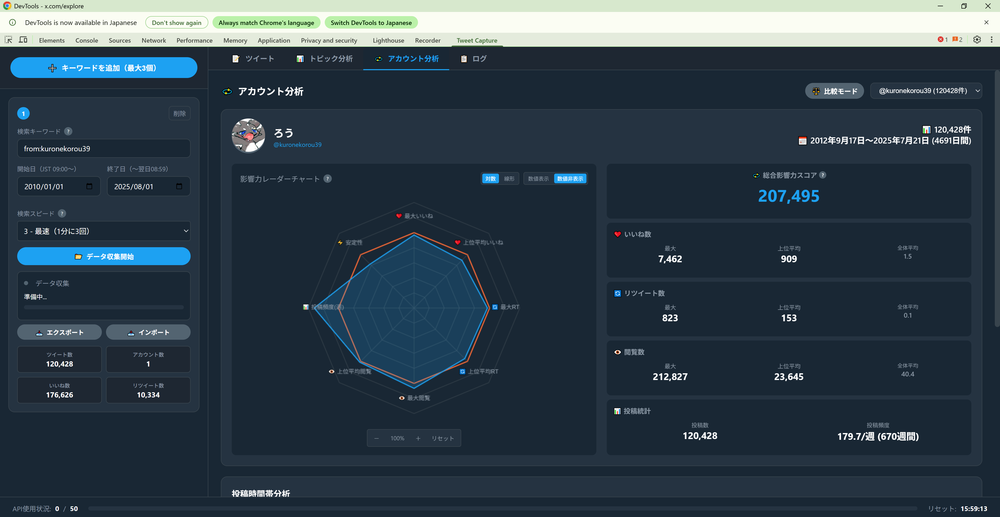
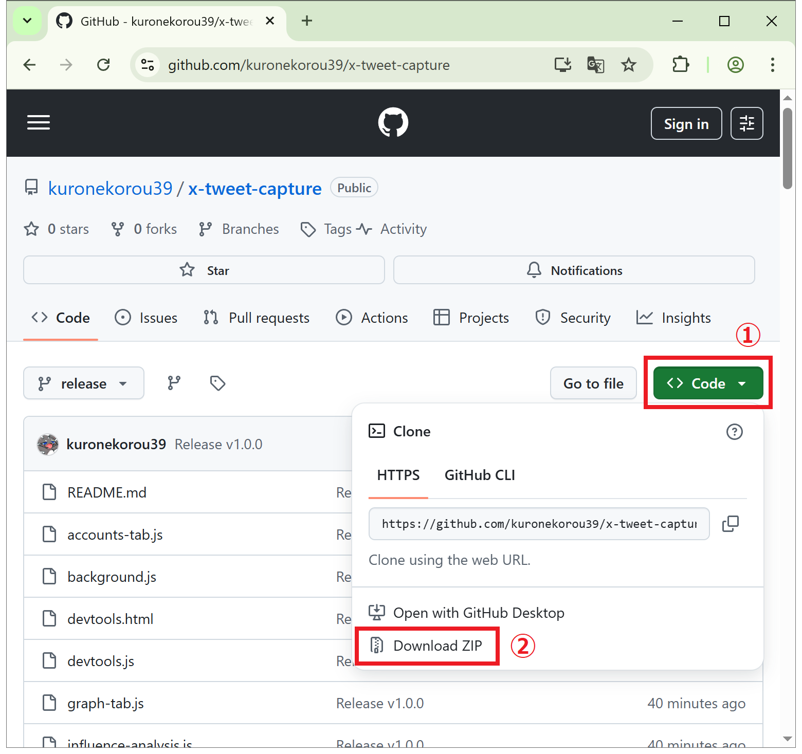
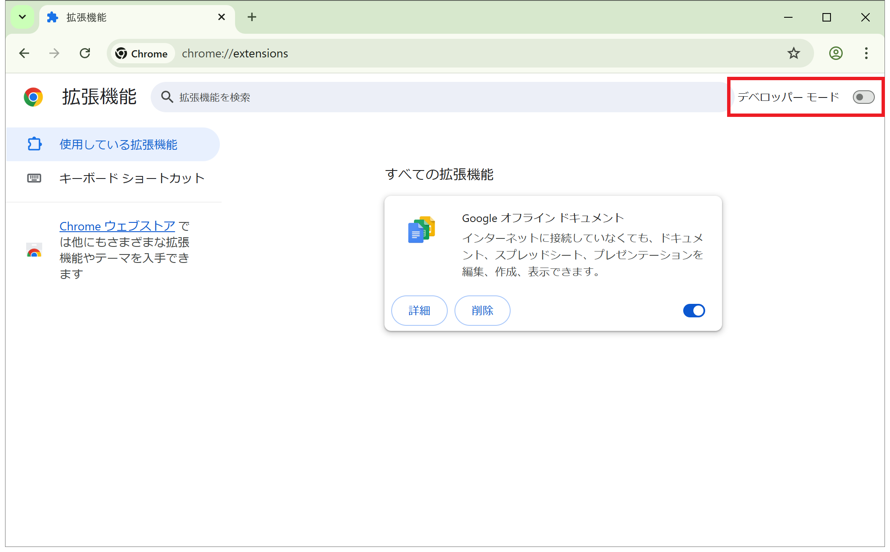
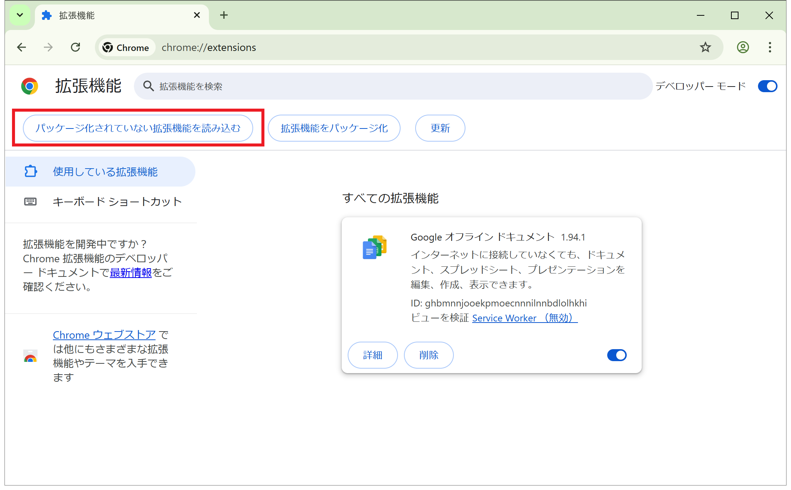
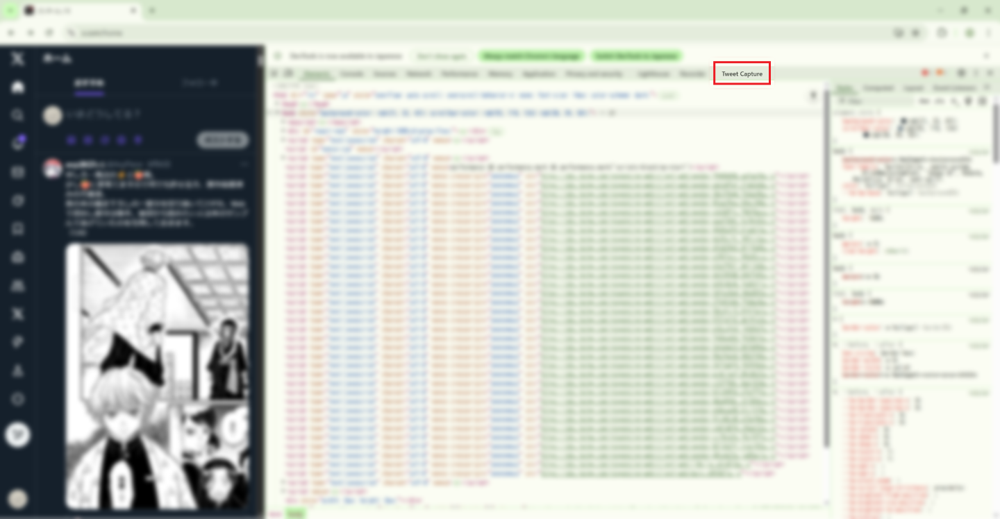
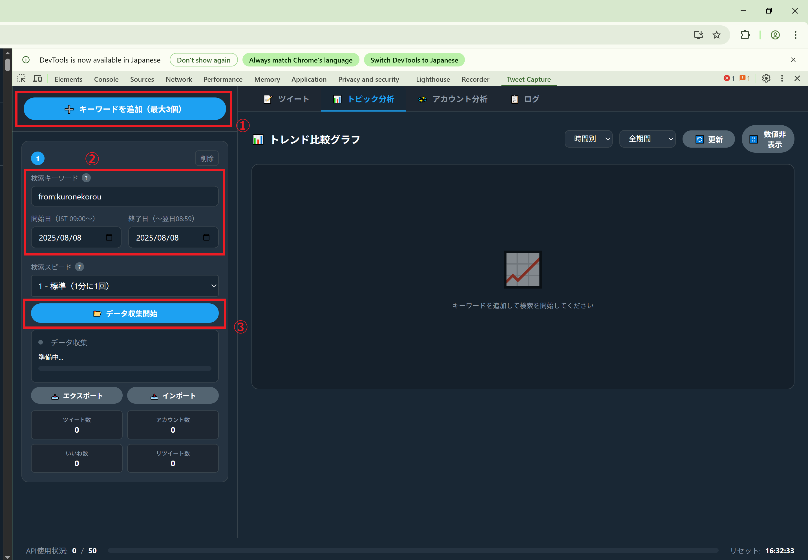
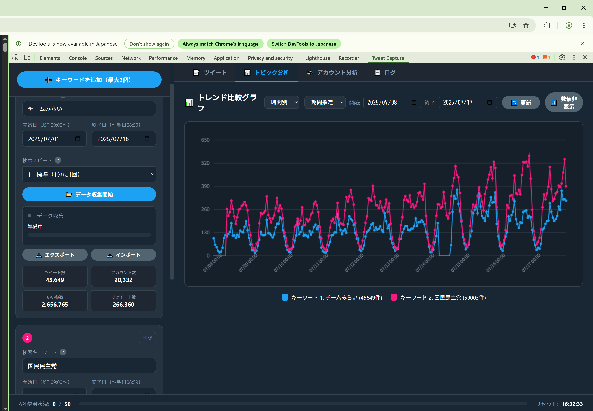
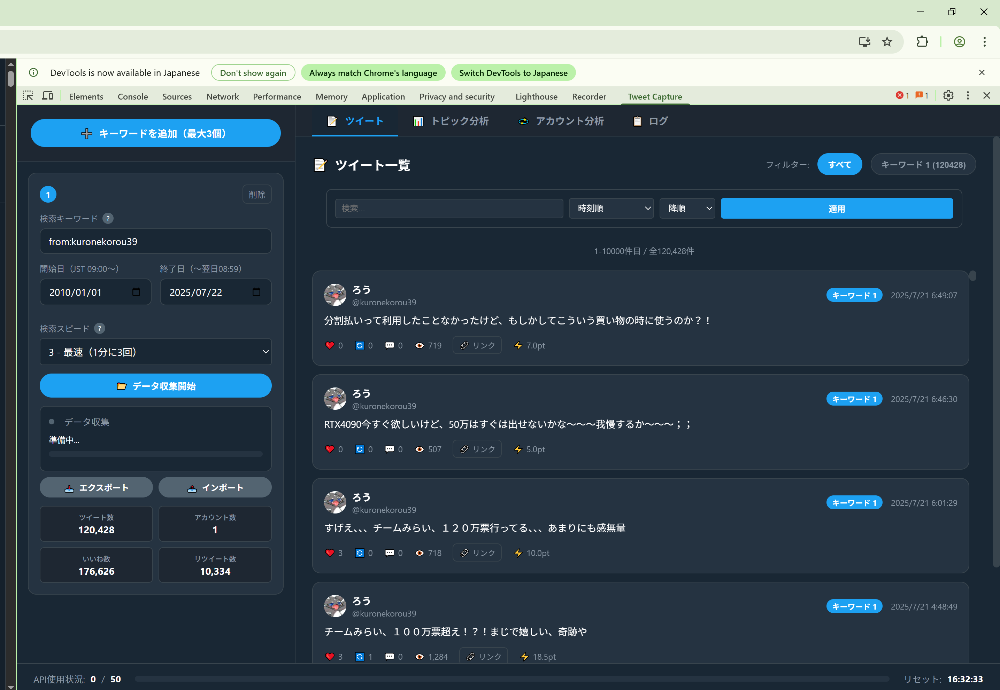
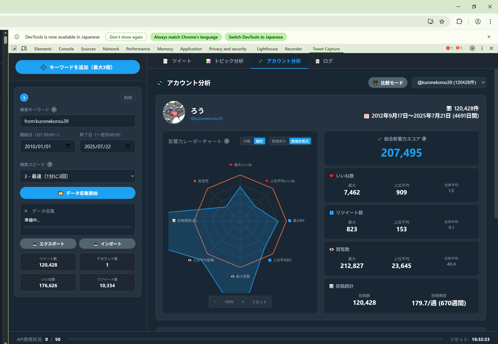

# X Tweet Capture

X（旧Twitter）のツイートを自動収集して、トレンドを分析できるツールです。  
特定のキーワードを含むツイートを収集し、グラフで可視化できます。

## ⚠️ 重要：使用前に必ずお読みください

**このツールは完全に自己責任でご利用ください。**

- ❌ **アカウント凍結・制限のリスク**
- ❌ **PCのフリーズ・クラッシュの可能性**  
- ❌ **データ損失のリスク**
- ❌ **予期しない動作による問題の可能性**

**製作者は一切の責任を負いません。十分ご理解の上でご利用ください。**



## 🚀 3分で始める！

### 1️⃣ インストール（1分）

1. **このページの緑色の「Code」ボタン** → **「Download ZIP」をクリック**
   

2. **ダウンロードしたZIPファイルを解凍**

3. **Chromeで `chrome://extensions/` を開く**
   - アドレスバーに直接入力してEnterキー

4. **右上の「デベロッパーモード」をON**
   

5. **「パッケージ化されていない拡張機能を読み込む」をクリック**
   

6. **解凍したフォルダを選択** → 完了！🎉

### 2️⃣ 使い方（2分）

1. **X（Twitter）にログイン**
   - https://x.com にアクセスしてログイン

2. **開発者ツールを開く**
   - **F12キー**を押す（または右クリック→「検証」）
   - 「**Tweet Capture**」タブをクリック
   

3. **キーワードを設定して収集開始！**
   
   - ① 「+ 新しいキーワードを追加」をクリック
   - ② 調べたいキーワードを入力（例：「AI」「ChatGPT」「from:○○」）
   - ③ 「📂 データ収集開始」をクリック

4. **自動でデータ収集が始まります**
   - 収集は自動で行われます
   - ゲームでもしながら待ちましょう🎮

## 📊 何ができるの？

### ✨ トレンドグラフ
キーワードの人気度の推移が一目でわかる！

- いいね数、リツイート数、閲覧数の推移
- 時間別、日別、週別、月別で表示切り替え

### 📝 ツイート一覧
収集したツイートを詳しく確認

- 影響力の高い順に並び替え
- キーワードで絞り込み検索

### 👥 インフルエンサー分析
どのくらい影響力を持っているかが分かる！

- トップインフルエンサーのランキング
- ユーザーごとの影響力をレーダーチャートで比較

### 💾 データの保存
収集したデータはいつでも保存・復元可能
- JSONファイルでダウンロード
- 後から再度読み込み可能

## ❓ よくある質問

### Q: 無料で使えますか？
**A: はい、完全無料です。**

### Q: どのくらいのデータを収集できますか？
**A: 制限はありませんが、1分に1回のペースで収集するため、大量のデータには時間がかかります。**

### Q: 収集したデータは安全ですか？
**A: すべてあなたのパソコン内に保存されます。外部には送信されません。**

### Q: エラーが出たらどうすればいい？
**A: ページをリロード（F5キー）して、もう一度試してください。**

### Q: 複数のキーワードを同時に調べられますか？
**A: はい、最大3つまで同時に収集できます。**

### Q: 検索が途中で止まってしまいます 🚨
**A: X（Twitter）のAPIバグです。終了日を1-2日早めて（例：2023-12-16 → 2023-12-14）再実行してください。詳細は「困ったときは」を参照。**

## 🎯 こんな使い方ができます

- 📈 **マーケティング**: 商品やブランドの評判を調査
- 🔍 **トレンド分析**: 話題のキーワードの盛り上がりを追跡
- 🎮 **趣味の分析**: 好きなゲームやアニメの反響を調査
- 📰 **ニュース追跡**: 特定のニュースへの反応を収集

## ⚠️ 注意事項・リスク

### 📛 **自己責任でのご利用をお願いします**

このツールの使用により発生するいかなる問題についても、製作者は一切責任を負いません：

- 🚫 **Xアカウントの凍結・制限・削除**
- 💻 **PCのフリーズ・クラッシュ・動作不良**
- 📊 **収集データの損失・破損**
- 🔒 **セキュリティ上の問題**
- ⚡ **システムリソースの過負荷**
- 📱 **その他予期しない動作や問題**

### 基本的な使用条件
- Xにログインしている必要があります
- 大量のデータ収集には時間がかかります（1000件で約17分）
- Xの仕様変更により動作しなくなる可能性があります
- **利用規約違反によるアカウント制限のリスクを理解してください**

## 🆘 困ったときは

### 収集が始まらない
1. Xにログインしているか確認
2. F12キーで開発者ツールを開き直す
3. ブラウザを再起動

### データが表示されない
1. 「グラフ」タブをクリック
2. 期間設定を「全期間」に変更
3. しばらく待ってから更新

### 🚨 検索が途中で止まってしまう（重要）

**X（Twitter）のAPIバグにより、特定の日付範囲で検索結果が0件になることがあります。**

#### 症状
- 長期間の検索（例：2010年～2025年）で途中で止まる
- 2020-2024頃で検索が停止することが多い
- ログに「0件のツイートを収集」と表示される

#### 解決方法
1. **検索を一旦停止**
2. **終了日を調整する**
   - 例：`2023-12-16` → `2023-12-14` に変更
   - 1-2日ずつ遡って試す
3. **「データ収集開始」で再開**
4. **問題なく収集が再開されたら、終了日を元に戻してもOK**

#### 💡 予防策
- 一度に長期間を指定しない（1年単位で区切る）
- エラーが起きやすい期間は短く区切って検索

---

## 📚 もっと詳しく知りたい方へ

<details>
<summary>高度な機能</summary>

### 検索スピード設定
データ収集の速度を調整できます：
- **標準**: 安定性重視（1分に1回）
- **高速**: バランス型（1分に2回）
- **最速**: 速度重視（1分に3回）

### 期間指定
特定の期間のツイートだけを収集：
- 開始日と終了日を指定
- 過去のイベント分析に便利

### データの統合
複数のデータファイルを統合：
- ドラッグ&ドロップで複数ファイルを一括インポート
- 重複ツイートは自動で除外

</details>

<details>
<summary>開発者向け情報</summary>

### 技術スタック
- Chrome Extension Manifest V3
- Vanilla JavaScript
- Chart.js
- X Internal API

### ファイル構成
```
x-tweet-capture/
├── manifest.json
├── background.js
├── devtools.js
├── panel.html
├── panel.js
├── graph-tab.js
├── tweets-tab.js
├── influence-analysis.js
└── accounts-tab.js
```

### 貢献
プルリクエスト歓迎です！

</details>

## 📜 ライセンス

MIT License - 自由に使用・改変できます

## ⚠️ 免責事項（重要）

### 🚨 **必ずお読みください**

**このツールを使用することにより発生した以下を含むあらゆる損害について、製作者は一切の責任を負いません：**

- **アカウント関連**: 凍結、制限、削除、その他のペナルティ
- **システム関連**: PCのクラッシュ、フリーズ、データ破損、セキュリティ問題
- **法的問題**: 利用規約違反、その他の法的トラブル
- **経済的損失**: データ損失による損害、復旧費用、その他の経済的損失
- **その他**: 予期しない問題、間接的な損害、精神的な損害

**使用者の完全な自己責任のもとでご利用ください。**

### 📋 推奨事項
- 大切なアカウントでの使用は避けてください
- 定期的にデータのバックアップを取ってください
- 長時間の連続使用は避けてください
- 問題が発生した場合は直ちに使用を停止してください

## 🙏 謝辞

このツールを自己責任でご利用いただく、すべての方に感謝します！

---

**⭐ もし気に入ったら、GitHubでスターをお願いします！**  
**（ただし、使用は完全に自己責任でお願いします）**